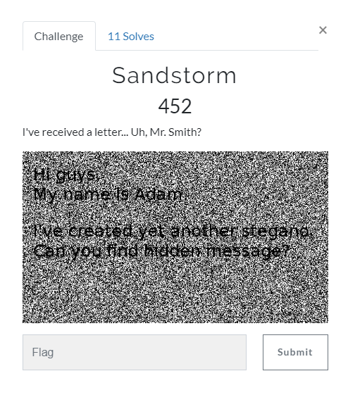
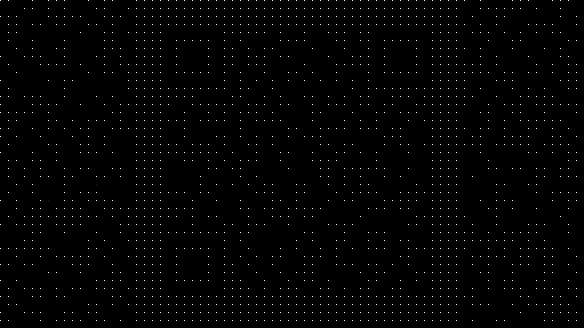
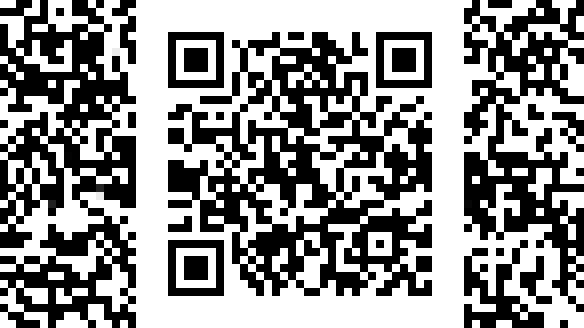

# SECCON 2019 Online CTF `Sandstorm [Misc]` writeup

## 問題


## 解答

ひとまずいつもの画像チェックを順次やっていく．

```
$ exiftool sandstorm.png
ExifTool Version Number         : 10.80
File Name                       : sandstorm.png   
Directory                       : .
File Size                       : 62 kB
File Modification Date/Time     : 2019:10:21 08:27:10+09:00
File Access Date/Time           : 2019:10:21 08:27:10+09:00
File Inode Change Date/Time     : 2019:10:21 08:27:10+09:00
File Permissions                : rwxrwxrwx       
File Type                       : PNG
File Type Extension             : png
MIME Type                       : image/png       
Image Width                     : 584
Image Height                    : 328
Bit Depth                       : 8
Color Type                      : RGB with Alpha  
Compression                     : Deflate/Inflate 
Filter                          : Adaptive        
Interlace                       : Adam7 Interlace 
Background Color                : 255 255 255
Image Size                      : 584x328
Megapixels                      : 0.192
```
exif情報のInterlaceにAdamがいるので目をつける．

[Wiki: Adam7 algorithm](https://en.wikipedia.org/wiki/Adam7_algorithm)


何段階目かの処理のところで文字が浮かび上がってきそうな予感．．．

少し調べると[ImageMagick で PNG の形式を変換](https://blog.awm.jp/2016/01/26/png/)にやり方が書いてあったのでこれを実行する．


```
convert sandstorm.png -filter Point -fx "!(i%8)*!(j%8)*u" sandstorm-adam7-1.png
```


一発でヒット．
文字化けかと思ったら名物QRコードだった．

このままでも手元のスマホでは読めてしまってQRコードすごいなぁと思いつつ一応補完．

```
convert  sandstorm.png -filter Point -fx "p{i-i%8,j-j%8}" sandstorm-adam7-1-cmpl.png
```


QRコードを読み込んだらflag GET
<details><summary>flag</summary><div>
SECCON{p0nlMpzlCQ5AHol6ls}
</div></details>

## 反省
早々に方針がたてれたのでかなり早く解けた．
png画像と見るや画像を確認せずにとりあえずzstegかけるのよくない．