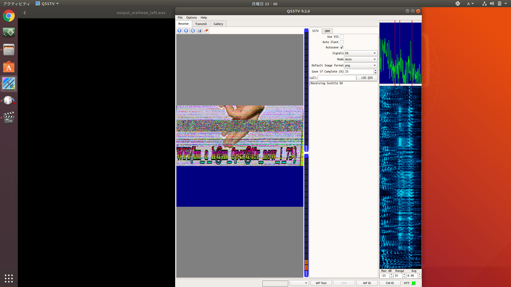

# \*Stallman intensifies*

## 解答
中身は5枚のJPEG画像とpass付の7zファイル

7zファイルが解凍できればflag GETと予想して，5枚のJPEG画像を調べる．

[青空白猫](https://digitaltravesia.jp/usamimihurricane/webhelp/_RESOURCE/MenuItem/another/anotherAoZoraSiroNeko.html)でJPEG画像を調べると，2枚の画像にsteghideの可能性があるらしい．

`exiftool`，`file`，`exiftool`，`steghide`，`strings`コマンドを一通り試していく．

上の画像の一番最後に`WPI+GNUCSC`といういかにもな文字列が出力されていて，これが7zファイルのパスワードだった．

解凍するとmp4ファイルが出てくるので，とりあえず視聴するもよくわからない．

*終わりじゃなかった......*

改めてちゃんと聞こうと思ってヘッドホンをつけると音がほとんど右側からしか聞こえず，左からは「ｶﾞﾋﾟｶﾞﾋﾟｶﾞﾋﾟｰ」とノイズのようなものが聞こえる．おかしい．

......が，音声のSteganography問題をやったことがなかったため，この違和感はいつのまにか忘れてフレームの切り出しなどに終始してしまい，お手上げでタイムアップ．
緑一色のフレームなどそれっぽいものもあってなかなか諦めきれなかった．

次の日，"**sstv signal**"なるものが使われていたというチャットを公式discordで見かける．
調べてみると，sstvという狭帯域での画像送信方法らしく，過去のCTF問題にもいくつかあったっぽい．
それらのWriteupを眺めると，[Qsstv](https://charlesreid1.com/wiki/Qsstv)というオープンソースプログラムを使えばsstv signalの画像化ができるらしい．
[Audacity](https://www.audacityteam.org/)で左側の音声を分離してからQsstvを通してみると，ノイズが一番ひどくなったタイミングでflag画像が出力された．画像が生成されていく様子はちょっと怖かった．

flag画像

WPI{im_a_h@m_0per@10r_now_!_73} (たぶん？)

## 反省
1つの方針にとらわれて時間が無くなってしまった．
結局は最初に感じた違和感が一番解答に近いものだったので，感覚はやっぱり大事．(サブカテゴリはMiscだったし)

## tool
+ [汎用ファイルアナライザ "青い空を見上げればいつもそこに白い猫](https://digitaltravesia.jp/usamimihurricane/webhelp/_RESOURCE/MenuItem/another/anotherAoZoraSiroNeko.html)
+ [Qsstv](https://charlesreid1.com/wiki/Qsstv)
+ [Audacity](https://www.audacityteam.org/)